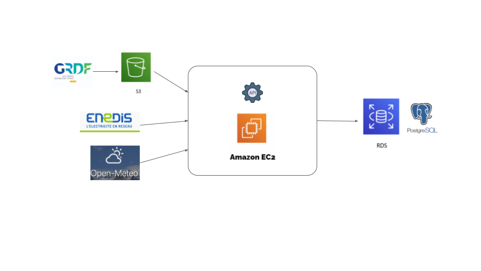

# API collecte données de consommations électricité/gaz/météo

Cette API à pour objectif de collecter toutes les 24 heures les données d'un logement particulier:
- de consommation horaire d'électricité
- de consommation journalière de gaz naturel
- de température extérieur

puis de les stocker dans une base de données. Cette base de données dessert ensuite une appplication de suivis des consommations.

L'architecture de l'API est représentées ci-dessous. GRDF ne fournit apparemment pas d'API pour les clients particulier. les données de consommations de gaz sont téléchargées manuellement et poussées vers un bucket.

## 📊 Sources utilisées

- API météo [OpenMeteo](https://pypi.org/project/openmeteo-requests/)
- API [Linky](https://conso.boris.sh/)   
- Données client GRDF  

## ⚙️ Technologie utilisées

- RDS AWS pour le stockage des données dans une base PostgreSQL
- S3 AWS pour le stockage des données GRDF
- EC2 AWS pour l'hergergement de l'API sur un serveur virtuel
- Python pour le code avec:
  - FastAPI pour le framework de l'API
  - apscheduler pour les appels quotidients des API météo et Linky
  - sqlalchemy pour l'insertion et la gestion des données vers PostgreSQL
- Docker pour le déploiement de l'API sur EC2

## 🗂️ Structure du dépôt

